## SECTION 0: Load Required Libraries

*Purpose* 

- Define all of the R packages needed for my analysis, install any that are missing (distinguishing between CRAN and Bioconductor packages), and then loads them into the session.


``` r
# ---- 0. Load Required Libraries ----  # Section header
# Define and install required libraries
required_packages <- c(
  "readxl",         # reading Excel files
  "dplyr",          # data manipulation
  "stringr",        # string operations
  "tidyr",          # data tidying
  "httr",           # HTTP requests
  "jsonlite",       # JSON parsing
  "purrr",          # functional programming tools
  "tibble",         # modern data frame structure
  "broom",          # tidying statistical model output
  "ReactomePA",     # pathway analysis (Bioconductor)
  "clusterProfiler",# enrichment analysis (Bioconductor)
  "org.Hs.eg.db",   # human gene annotation database (Bioconductor)
  "enrichplot",     # plotting enrichment results (Bioconductor)
  "ggplot2",        # data visualization
  "forcats",        # factor level manipulation
  "fmsb",           # utilities for radar charts and more
  "BiocManager"     # managing Bioconductor installations
)

# Install missing libraries
for (pkg in required_packages) {
  if (!requireNamespace(pkg, quietly = TRUE)) {
    if (pkg %in% c("ReactomePA", "clusterProfiler", "org.Hs.eg.db", "enrichplot")) {
      BiocManager::install(pkg, update = FALSE)
    } else {
      install.packages(pkg)
    }
  }
}
```

```
## 
```

```
## 
```

``` r
# Load libraries
invisible(lapply(required_packages, library, character.only = TRUE))
```

```
## Warning: package 'readxl' was built under R version 4.4.3
```

```
## Warning: package 'dplyr' was built under R version 4.4.3
```

```
## 
## Attaching package: 'dplyr'
```

```
## The following objects are masked from 'package:stats':
## 
##     filter, lag
```

```
## The following objects are masked from 'package:base':
## 
##     intersect, setdiff, setequal, union
```

```
## Warning: package 'jsonlite' was built under R version 4.4.3
```

```
## 
## Attaching package: 'purrr'
```

```
## The following object is masked from 'package:jsonlite':
## 
##     flatten
```

```
## Warning: package 'broom' was built under R version 4.4.3
```

```
## ReactomePA v1.50.0 Learn more at https://yulab-smu.top/contribution-knowledge-mining/
## 
## Please cite:
## 
## Guangchuang Yu, Qing-Yu He. ReactomePA: an R/Bioconductor package for
## reactome pathway analysis and visualization. Molecular BioSystems.
## 2016, 12(2):477-479
```

```
## clusterProfiler v4.14.6 Learn more at https://yulab-smu.top/contribution-knowledge-mining/
## 
## Please cite:
## 
## Guangchuang Yu, Li-Gen Wang, Yanyan Han and Qing-Yu He.
## clusterProfiler: an R package for comparing biological themes among
## gene clusters. OMICS: A Journal of Integrative Biology. 2012,
## 16(5):284-287
```

```
## 
## Attaching package: 'clusterProfiler'
```

```
## The following object is masked from 'package:purrr':
## 
##     simplify
```

```
## The following object is masked from 'package:stats':
## 
##     filter
```

```
## Loading required package: AnnotationDbi
```

```
## Loading required package: stats4
```

```
## Loading required package: BiocGenerics
```

```
## 
## Attaching package: 'BiocGenerics'
```

```
## The following objects are masked from 'package:dplyr':
## 
##     combine, intersect, setdiff, union
```

```
## The following objects are masked from 'package:stats':
## 
##     IQR, mad, sd, var, xtabs
```

```
## The following objects are masked from 'package:base':
## 
##     anyDuplicated, aperm, append, as.data.frame, basename, cbind,
##     colnames, dirname, do.call, duplicated, eval, evalq, Filter, Find,
##     get, grep, grepl, intersect, is.unsorted, lapply, Map, mapply,
##     match, mget, order, paste, pmax, pmax.int, pmin, pmin.int,
##     Position, rank, rbind, Reduce, rownames, sapply, saveRDS, setdiff,
##     table, tapply, union, unique, unsplit, which.max, which.min
```

```
## Loading required package: Biobase
```

```
## Welcome to Bioconductor
## 
##     Vignettes contain introductory material; view with
##     'browseVignettes()'. To cite Bioconductor, see
##     'citation("Biobase")', and for packages 'citation("pkgname")'.
```

```
## 
## Attaching package: 'Biobase'
```

```
## The following object is masked from 'package:httr':
## 
##     content
```

```
## Loading required package: IRanges
```

```
## Loading required package: S4Vectors
```

```
## 
## Attaching package: 'S4Vectors'
```

```
## The following object is masked from 'package:clusterProfiler':
## 
##     rename
```

```
## The following object is masked from 'package:tidyr':
## 
##     expand
```

```
## The following objects are masked from 'package:dplyr':
## 
##     first, rename
```

```
## The following object is masked from 'package:utils':
## 
##     findMatches
```

```
## The following objects are masked from 'package:base':
## 
##     expand.grid, I, unname
```

```
## 
## Attaching package: 'IRanges'
```

```
## The following object is masked from 'package:clusterProfiler':
## 
##     slice
```

```
## The following object is masked from 'package:purrr':
## 
##     reduce
```

```
## The following objects are masked from 'package:dplyr':
## 
##     collapse, desc, slice
```

```
## The following object is masked from 'package:grDevices':
## 
##     windows
```

```
## 
## Attaching package: 'AnnotationDbi'
```

```
## The following object is masked from 'package:clusterProfiler':
## 
##     select
```

```
## The following object is masked from 'package:dplyr':
## 
##     select
```

```
## enrichplot v1.26.6 Learn more at https://yulab-smu.top/contribution-knowledge-mining/
## 
## Please cite:
## 
## T Wu, E Hu, S Xu, M Chen, P Guo, Z Dai, T Feng, L Zhou, W Tang, L Zhan,
## X Fu, S Liu, X Bo, and G Yu. clusterProfiler 4.0: A universal
## enrichment tool for interpreting omics data. The Innovation. 2021,
## 2(3):100141
```

```
## Warning: package 'ggplot2' was built under R version 4.4.3
```

```
## Warning: package 'fmsb' was built under R version 4.4.3
```

```
## Warning: package 'BiocManager' was built under R version 4.4.3
```

```
## Bioconductor version '3.20' is out-of-date; the current release version '3.21'
##   is available with R version '4.5'; see https://bioconductor.org/install
```

*Step-by-step Breakdown*

1. `required_packages <- c(...)`

- Creates a character vector required_packages containing the names of all packages your script will use.

2. `for (pkg in required_packages) { … }`

- Starts a loop that goes through each package name stored in required_packages.

3. `if (!requireNamespace(pkg, quietly = TRUE)) { … }`

- Checks whether the package pkg is already installed (without loading it). If not installed, proceeds to the next step.

4. `if (pkg %in% c("ReactomePA", "clusterProfiler", "org.Hs.eg.db", "enrichplot")) { BiocManager::install(pkg, update = FALSE) }`

- Installs Bioconductor packages via `BiocManager::install()` without updating other packages.

5. `else { install.packages(pkg) }`

- Installs CRAN packages with `install.packages()` if they’re not among the specified Bioconductor set.

6. `invisible(lapply(required_packages, library, character.only = TRUE))`

- Loads each package into the R session using `library()`. Wrapping in `invisible()` suppresses the usual startup messages. 

---

## SECTION 1: Data Loading & Cleaning Pipeline

*Purpose*

- Read in the proteomics data from Excel, remove any rows or columns that are entirely NA, and then parse out the gene symbol and protein accession from a identifier column. Then, compute a simple “detection score” by summing up presence/abundance values across all sample columns.


``` r
# ---- 1. Load & Clean Data ----
# Load data from Excel, remove empty rows/columns, and extract gene/protein details
sarco <- read_excel(
  "13_MASTER_SEER proteome analysis (4-4-23).xlsx",
  sheet = "MASTER_SARCO_data"
) %>%
  # Keep only columns where at least one value is non-NA
  dplyr::select(where(~ any(!is.na(.)))) %>%
  # Remove any rows that are entirely NA
  filter(if_any(everything(), ~ !is.na(.))) %>%
  # Parse out Gene_Symbol and Accession from the Gene_protein column
  mutate(
    Gene_Symbol = str_remove(
      str_extract(Gene_protein, "^[^_;]+"),
      ";?GN=+$"
    ),
    Accession   = str_extract(
      Gene_protein,
      "\\b[A-Z][0-9][A-Z0-9]{3}[0-9]\\b"
    )
  )

# Identify which columns correspond to sample measurements
sample_cols <- grep("^(EAA|PRE|POST|PPS)", names(sarco), value = TRUE)

# Compute a detection score by summing across all sample columns
sarco <- sarco %>%
  mutate(
    detection_score = rowSums(
      across(all_of(sample_cols)),
      na.rm = TRUE
    )
  )
```

*Step-by-Step Breakdown*

1. `sarco <- read_excel(..., sheet = "MASTER_SARCO_data")`

- Uses readxl’s `read_excel()` to import the specified worksheet into a data frame called sarco.

2. `dplyr::select(where(~ any(!is.na(.))))`

- Selects only those columns in which at least one entry is not NA, effectively dropping empty columns.

3. `filter(if_any(everything(), ~ !is.na(.)))`

- Keeps only rows where any column has a non-NA value, removing fully empty rows.

4. `mutate( Gene_Symbol = ..., Accession = ... )`

  - `str_extract(Gene_protein, "^[^_;]+")` pulls the first chunk before any semicolon or underscore from Gene_protein.

  - `str_remove(..., ";?GN=+$")` then strips any trailing “;GN=” patterns to clean the gene symbol.

  - `str_extract(..., "\\b[A-Z][0-9][A-Z0-9]{3}[0-9]\\b")` captures the UniProt-style accession (e.g., “P12345”).

5. `sample_cols <- grep("^(EAA|PRE|POST|PPS)", names(sarco), value = TRUE)`

- Uses base R’s grep() to find all column names starting with “EAA”, “PRE”, “POST”, or “PPS”, storing them for later.

6. `mutate(detection_score = rowSums(across(all_of(sample_cols)), na.rm = TRUE))`

- With dplyr’s `across()`, selects the sample columns, then applies base R’s `rowSums()` (ignoring NA) to give each row a total count or abundance score.

*Key Packages*

`readxl`: Importing Excel (XLSX) data directly into R without Java dependencies.

`dplyr`: Core tools for data frame manipulation—selecting, filtering, mutating, and piping (`%>%`).

`stringr`: Convenient functions for regex-based string extraction and removal (`str_extract()`, `str_remove()`).

---

## SECTION 2: Query UniProt for Missing Gene Symbols

*Purpose*

- Define a function to retrieve missing gene symbols by querying the UniProt REST API for a list of protein accession IDs, and then apply this function to those accessions in my dataset that lack an assigned Gene_Symbol.


``` r
# ---- 2. Query UniProt for Missing Gene Symbols ----

# Define UniProt query function
query_uniprot <- function(accessions) {
  url <- "https://rest.uniprot.org/uniprotkb/search"
  # Construct OR-separated query string from the vector of accession IDs
  q <- paste(accessions, collapse = " OR ")
  # Perform GET request: ask for accession and primary gene name, JSON format, up to 500 entries
  r <- GET(
    url,
    query = list(
      query  = q,
      fields = "accession,gene_primary",
      format = "json",
      size   = 500
    )
  )
  # If the request is successful, parse JSON and return a tibble of results
  if (status_code(r) == 200) {
    j <- httr::content(r, as = "parsed", type = "application/json")
    tibble(
      Accession       = sapply(j$results, function(x) x$primaryAccession),
      Gene_Symbol_API = sapply(
        j$results,
        function(x)
          if (!is.null(x$genes[[1]]$geneName$value))
            x$genes[[1]]$geneName$value
          else
            NA_character_
      )
    )
  } else {
    stop("UniProt query failed")
  }
}

# Identify accessions requiring a UniProt query:
#  1. For each (Accession, existing Gene_Symbol) pair, keep the row with highest detection_score
#  2. Filter those with missing or empty Gene_Symbol
#  3. Extract unique accession IDs
accessions_to_query <- sarco %>%
  group_by(Accession, Gene_Symbol) %>%
  slice_max(detection_score, n = 1, with_ties = FALSE) %>%
  ungroup() %>%
  filter(is.na(Gene_Symbol) | Gene_Symbol == "") %>%
  pull(Accession) %>%
  unique() %>%
  na.omit()

# Break the list into chunks of 100 accessions, query UniProt for each chunk,
# then row-bind all results and remove duplicate accessions
uniprot_results <- accessions_to_query %>%
  split(ceiling(seq_along(.) / 100)) %>%
  map_dfr(query_uniprot) %>%
  distinct(Accession, .keep_all = TRUE)
```

*Step-by-Step Breakdown*

1. `query_uniprot <- function(accessions) { … }`

- Defines a reusable function taking a character vector of UniProt accession IDs.

2. `q <- paste(accessions, collapse = " OR ")`

- Joins IDs into a single search string where each ID is separated by OR, matching the UniProt query syntax.

3. r ` <- GET(url, query = list(...))`

- Uses httr’s `GET()` to call the UniProt REST endpoint, requesting only accession and `gene_primary` fields in JSON form, up to 500 records.

4. `if (status_code(r) == 200) { … } else stop("UniProt query failed")`

- Checks for a successful HTTP 200 response; otherwise stops execution with an error.

5. `j <- httr::content(r, as = "parsed", type = "application/json")`

- Parses the JSON content into an R list for further processing.

6. `tibble(Accession = sapply(j$results, …), Gene_Symbol_API = sapply(j$results, …))`

- Iterates through j$results, extracting primaryAccession and the first geneName$value (if present) into a two‐column tibble.

7. `accessions_to_query <- sarco %>% group_by(...) %>% slice_max(...) %>% filter(...) %>% pull(...) %>% unique() %>% na.omit()`

  - `group_by(Accession, Gene_Symbol)` then `slice_max(detection_score, n = 1)` ensures one representative row per accession/symbol.

  - `filter(is.na(Gene_Symbol) | Gene_Symbol == "")` selects only those with missing symbols.

  - `pull(Accession)` extracts the vector of IDs, then unique() and na.omit() clean it.

8. `split(ceiling(seq_along(.) / 100))`

- Splits the accession vector into sublists of up to 100 IDs each, to respect potential API size limits.

9. `map_dfr(query_uniprot)`

- Applies `query_uniprot()` to each sublist and row‐binds (_dfr) all returned tibbles.

10. `distinct(Accession, .keep_all = TRUE)`

- Removes any duplicate rows by accession, retaining the first occurrence of each.

*Key Packages*

`httr`: Facilitates HTTP requests (here, `GET()`) and response handling for REST APIs.

`jsonlite`: Underlies JSON parsing; though here httr::content() is used directly, jsonlite is a dependency for parsing.

`tibble`: Creates tidy, modern data frames for the API results.

`purrr`: Provides map_dfr() to iterate over list elements and combine results efficiently.

`dplyr`: Used for data wrangling—grouping, filtering, pulling columns, and chaining operations via the pipe.

---

## SECTION 3: Merge and Clean Gene Symbols

*Purpose*

- Join the UniProt‐derived gene symbols back into my main sarco (sarcoplasm) table, uses them to fill any missing or empty original symbols, strip out any "isoform_" prefixes, and then drop the temporary API column.


``` r
# ---- 3. Merge and Clean Gene Symbols ----
# Merge UniProt results and clean up gene symbols
sarco <- sarco %>%
  # Add Gene_Symbol_API from the UniProt query by matching on Accession
  left_join(uniprot_results, by = "Accession") %>%
  # Replace missing/empty Gene_Symbol with the API‐provided value,
  # then remove any leading "isoform_" text
  mutate(
    Gene_Symbol = if_else(
      is.na(Gene_Symbol) | Gene_Symbol == "",
      Gene_Symbol_API,
      Gene_Symbol
    ),
    Gene_Symbol = str_remove(Gene_Symbol, "^isoform_")
  ) %>%
  # Drop the now‐redundant API column
  dplyr::select(-Gene_Symbol_API)
```

*Step-by-Step Breakdown*

1. `left_join(uniprot_results, by = "Accession")`

- Performs a left join of sarco with `uniprot_results` on the `Accession` column, adding a new column `Gene_Symbol_API` containing the API query results for each accession.

2. `mutate(Gene_Symbol = if_else(...))`

- Uses dplyr’s `if_else()` to update `Gene_Symbol`: if the existing symbol is NA or an empty string, it replaces it with `Gene_Symbol_API`; otherwise, it leaves the original symbol intact.

3. `mutate(Gene_Symbol = str_remove(...))`

- Applies stringr’s `str_remove()` with the regex `^isoform_` to strip off any "`isoform_`" prefix from the updated gene symbols.

4. `dplyr::select(-Gene_Symbol_API)`

- Drops the helper column `Gene_Symbol_API`, since its values have been merged into `Gene_Symbol` and are no longer needed.

*Key Packages*

dplyr: For data manipulation verbs (`left_join()`, `mutate()`, `select()`) and piping.

stringr: For regex‐based string cleaning with `str_remove()`.

---

## SECTION 4: Remove Duplicates by Detection Score

*Purpose*

- De-duplicate the sarco dataset by first retaining the entry with the highest detection score for each unique Accession–Gene combination, and then ensuring that each `Gene_Symbol` appears only once by keeping its highest‐scoring record.


``` r
# ---- 4. Remove Duplicates by Detection Score ----
sarco_clean <- sarco %>%
  # For each (Accession, Gene_Symbol) pair, keep only the row with the highest detection_score
  group_by(Accession, Gene_Symbol) %>%
  slice_max(detection_score, n = 1, with_ties = FALSE) %>%
  ungroup() %>%
  # Then, for each Gene_Symbol (across any accessions), keep only the row with the highest detection_score
  group_by(Gene_Symbol) %>%
  slice_max(detection_score, n = 1, with_ties = FALSE) %>%
  ungroup()
```

*Step-by-Step Breakdown*

1. `group_by(Accession, Gene_Symbol)`

- Uses dplyr to create groups defined by each unique combination of `Accession` and `Gene_Symbol.`

2. `slice_max(detection_score, n = 1, with_ties = FALSE)`

  - Within each group, selects the single row with the maximum `detection_score.`

  - `n = 1` ensures only one row is kept; `with_ties = FALSE` breaks ties by arbitrarily dropping extras.

3. `ungroup()`

- Removes the current grouping structure so subsequent operations are applied to the whole data frame.

4. `group_by(Gene_Symbol)`

- Regroups the pruned dataset by `Gene_Symbol` alone, so that each gene symbol’s entries (potentially from multiple accessions) form a group.

5. `slice_max(detection_score, n = 1, with_ties = FALSE)`

- Again, selects the top `detection_score` row within each `Gene_Symbol` group, ensuring one representative per gene.

6. `ungroup()`

- Finalizes the operation by removing grouping, yielding the cleaned `sarco_clean` data frame.

*Key Packages*

dplyr: Provides the chaining (`%>%`), grouping (`group_by()`), slice-based selection (`slice_max()`), and ungrouping (`ungroup()`) verbs used to filter and de-duplicate the data.

---

## SECTION 5: Convert to Long Format

*Purpose*

- Reshape the de-duplicated, wide‐format proteomics data into a long‐format table suitable for downstream analysis, add metadata columns for timepoint and experimental group based on sample names, and then save both the long and wide cleaned datasets.


``` r
# ---- 5. Convert to Long Format ----

long_df <- sarco_clean %>%
  # Drop any leftover statistical summary or helper columns
  dplyr::select(-matches("^T-test_|^DELTA_|^CORREL_|^Young_|^detection_")) %>%
  # Pivot the sample measurement columns into two columns: Sample (name) and Abundance (value)
  pivot_longer(
    cols       = all_of(sample_cols),
    names_to   = "Sample",
    values_to  = "Abundance"
  ) %>%
  # Exclude any rows where Sample refers to averages or standard deviations
  filter(!str_detect(Sample, "_Avg|_StdDev")) %>%
  # Derive new metadata columns from the Sample names
  mutate(
    Timepoint = case_when(
      str_detect(Sample, "PRE")  ~ "Pre",   # Samples containing "PRE"
      str_detect(Sample, "POST") ~ "Post",  # Samples containing "POST"
      TRUE                       ~ NA_character_
    ),
    Group = case_when(
      str_detect(Sample, "EAA|PPS") ~ "Young",  # Young group prefixes
      TRUE                          ~ "MA"      # Otherwise, Middle‐Aged
    )
  )

# Save the reshaped long and the cleaned wide datasets
write.csv(long_df,    "Clean_Long2.csv", row.names = FALSE)
write.csv(sarco_clean, "Clean_Wide2.csv", row.names = FALSE)
```

*Step-by-Step Breakdown*

1. `dplyr::select(-matches("^T-test_|^DELTA_|^CORREL_|^Young_|^detection_"))`

- Removes any columns whose names begin with summary prefixes (e.g. “T-test_”, “DELTA_”) or the original detection score, keeping only raw sample measurements and annotation fields.

2. `pivot_longer(cols = all_of(sample_cols), names_to = "Sample", values_to = "Abundance")`

- Uses tidyr to transform the wide set of sample columns into a long format, creating one row per sample measurement with the column name in Sample and its value in Abundance.

3. `filter(!str_detect(Sample, "_Avg|_StdDev"))`

- Excludes rows where the Sample name indicates an average or standard deviation column (e.g., “_Avg” or “_StdDev”) via stringr’s str_detect().

4. `mutate(Timepoint = case_when(...), Group = case_when(...))`

  - Adds a Timepoint column labeling each row as “Pre” or “Post” based on whether Sample contains “PRE” or “POST”.

  - Adds a Group column labeling samples as “Young” if the name contains “EAA” or “PPS”, otherwise “MA” for middle‐aged.

5. `write.csv()`

- Exports long_df and the cleaned wide data frame sarco_clean to CSV files for future use.

*Key Packages*

dplyr: Chaining operations (`%>%`), selecting/deselecting columns, filtering rows, and creating new columns (`mutate()`).

tidyr: Reshaping data with `pivot_longer()`.

stringr: String pattern matching with `str_detect()` to identify and exclude unwanted rows and to derive metadata.

---

## SECTION 6: Summary Table of Mean Abundances

*Purpose*

- Compute the average protein abundance for each gene across the defined experimental groups (“Young”, “Pre_MA”, “Post_MA”), reshape the results into a wide summary table, and save it as a CSV for later (could use for something else).


``` r
# ---- 6. Summary Table: Mean Abundances ----

mean_abundance_summary <- long_df %>%
  # Define a new grouping variable based on Timepoint and Group
  mutate(
    Grouping = case_when(
      Group == "Young"                ~ "Young",    # Young subjects
      Group == "MA" & Timepoint == "Pre"  ~ "Pre_MA",   # Middle-aged Pre-training
      Group == "MA" & Timepoint == "Post" ~ "Post_MA",  # Middle-aged Post-training
      TRUE                            ~ NA_character_
    )
  ) %>%
  # Exclude any rows where we couldn't assign a valid grouping
  filter(!is.na(Grouping)) %>%
  # Calculate the mean abundance for each gene in each grouping
  group_by(Gene_Symbol, Grouping) %>%
  summarise(
    Mean_Abundance = mean(Abundance, na.rm = TRUE),
    .groups = "drop"
  ) %>%
  # Pivot the summary so each grouping becomes its own column
  pivot_wider(
    names_from = Grouping,
    values_from = Mean_Abundance
  )

# Write the summary table to disk
write.csv(
  mean_abundance_summary,
  "Group_Abundance.csv",
  row.names = FALSE
)
```

*Step-by-Step Breakdown*

1. `mutate(Grouping = case_when(...))`
Creates a new Grouping column:

  - `“Young”` for samples labeled as young subjects.

  - `“Pre_MA”` for middle-aged pre-training samples.

  - `“Post_MA”` for middle-aged post-training samples.

  - NA otherwise.

2. `filter(!is.na(Grouping))`

- Drops any rows where Grouping is NA, ensuring only valid groups remain.

3. `group_by(Gene_Symbol, Grouping)`

- Organizes the data into groups defined by gene symbol and the new grouping variable.

4, `summarise(Mean_Abundance = mean(Abundance, na.rm = TRUE), .groups = "drop")`

- Calculates the average Abundance within each gene–group pair, removing grouping afterwards (`.groups = "drop"`).

5. `pivot_wider(names_from = Grouping, values_from = Mean_Abundance)`

- Converts the long summary into a wide format, with one column per grouping (e.g., Young, Pre_MA, Post_MA).

6. `write.csv(mean_abundance_summary, "Group_Abundance.csv", row.names = FALSE)`

- Exports the resulting summary table to a CSV file without row names.

*Key Packages*

dplyr: For data transformation verbs (`mutate()`, `filter()`, `group_by()`, `summarise()`) and piping.

tidyr: For reshaping data with `pivot_wider()`.

utils (base R): Provides `write.csv()` to export data frames to CSV files.

---

## SECTION 7: Compute log2FC and Per-Gene Stats

*Purpose*

- Calculate log2 fold-changes between experimental groups for each protein and then perform statistical tests (t-tests) comparing Pre_MA vs Young, Post_MA vs Young, and Post_MA vs Pre_MA. Then, adjust p-values for multiple testing and merges fold-change and statistics into one table.


``` r
# ---- 7. Compute log2FC and Per-Gene Stats ----

    # 1. Calculate log2 fold-change from mean abundances
fc_df <- mean_abundance_summary %>%
  mutate(
    log2FC_Pre_vs_Young    = log2(Pre_MA   / Young),  # Pre-training MA vs Young
    log2FC_Post_vs_Young   = log2(Post_MA  / Young),  # Post-training MA vs Young
    log2FC_Post_vs_Pre_MA  = log2(Post_MA  / Pre_MA)  # Post vs Pre within MA
  )

    # 2. For each gene, run three t-tests and collect p-values
stat_df <- long_df %>%
  group_by(Gene_Symbol) %>%             # operate within each gene
  do({
    df <- .                             # capture the per-gene subset

      # Pre_MA vs Young comparison
    df1 <- df %>% 
      filter((Group == "MA" & Timepoint == "Pre") | Group == "Young")
    p1  <- if (n_distinct(df1$Group) == 2) 
             t.test(Abundance ~ Group, data = df1)$p.value 
           else NA_real_

      # Post_MA vs Young comparison
    df2 <- df %>% 
      filter((Group == "MA" & Timepoint == "Post") | Group == "Young")
    p2  <- if (n_distinct(df2$Group) == 2) 
             t.test(Abundance ~ Group, data = df2)$p.value 
           else NA_real_

      # Post_MA vs Pre_MA within MA
    df3 <- df %>% 
      filter(Group == "MA", Timepoint %in% c("Pre", "Post"))
    p3  <- if (n_distinct(df3$Timepoint) == 2) 
             t.test(Abundance ~ Timepoint, data = df3)$p.value 
           else NA_real_

      # Return a one-row tibble of p-values
    tibble(
      p_Pre_vs_Young    = p1,
      p_Post_vs_Young   = p2,
      p_Post_vs_Pre_MA  = p3
    )
  }) %>%
  ungroup() %>%                        # remove grouping
  mutate(
    # 3. Adjust all three sets of p-values using the FDR method
    adj_Pre_vs_Young    = p.adjust(p_Pre_vs_Young,    method = "fdr"),
    adj_Post_vs_Young   = p.adjust(p_Post_vs_Young,   method = "fdr"),
    adj_Post_vs_Pre_MA  = p.adjust(p_Post_vs_Pre_MA,  method = "fdr")
  )

    # 4. Merge fold-change and statistics into a single data frame
gene_stats <- fc_df %>%
  left_join(stat_df, by = "Gene_Symbol")
```

*Step-by-Step Breakdown*

1. `mutate(log2FC_... = log2(...))`

- Computes the log2 fold-change for each comparison by taking the ratio of mean abundances.

2. `group_by(Gene_Symbol)`

- Splits the long-format data into subsets, one per gene.

3. `do({ … })`

  - Executes custom code for each gene subset:

  - `filter()` selects the two groups to compare for each test.

  - `n_distinct(...)=2` checks that both groups are present.

  - `t.test(Abundance ~ Group or Timepoint)` performs the t-test.

  - Results are packed into a one-row tibble of p-values.

4. `p.adjust(..., method = "fdr")`

- Applies the Benjamini–Hochberg procedure to control the false discovery rate across all genes for each comparison.

5. `left_join(stat_df, by = "Gene_Symbol")`

- Combines the fold-change data (`fc_df`) with the statistics (`stat_df`) into gene_stats.

*Key Packages*

dplyr: For data manipulation verbs (`mutate()`, `group_by()`, `filter()`, `ungroup()`, `left_join()`), piping, and `slice_max()`.

tibble: Creates the one-row tibbles of p-values in the `do()` call.

---

## SECTION 8: Pathway Enrichment Analysis (Aging in Muscle)

*Purpose*

- Convert gene symbols to Entrez IDs and then conduct pathway enrichment analyses (KEGG, Reactome, and GO Biological Process) for the “Pre_MA vs Young” comparison to identify biological pathways associated with aging in muscle.


``` r
# ---- 8. Pathway Enrichment Analysis (Aging in Muscle) ----

# 1. Map gene symbols to Entrez IDs using the org.Hs.eg.db annotation database
entrez_map <- bitr(
  gene_stats$Gene_Symbol,      # Input vector of gene symbols
  fromType = "SYMBOL",         # Convert from SYMBOL
  toType   = "ENTREZID",       # Convert to ENTREZID
  OrgDb    = org.Hs.eg.db      # Human annotation package
)
```

```
## 'select()' returned 1:many mapping between keys and columns
```

```
## Warning in bitr(gene_stats$Gene_Symbol, fromType = "SYMBOL", toType =
## "ENTREZID", : 0.79% of input gene IDs are fail to map...
```

``` r
# 2. Prepare a named numeric vector of log2 fold-changes for enrichment
gene_list_Pre_vs_Young <- gene_stats %>%
  inner_join(entrez_map, by = c("Gene_Symbol" = "SYMBOL")) %>%  # Keep only genes with Entrez IDs
  arrange(desc(log2FC_Pre_vs_Young)) %>%                        # Sort descending by effect size
  { set_names(.$log2FC_Pre_vs_Young, .$ENTREZID) }              # Create named vector: names = ENTREZID, values = log2FC

# 3. Run KEGG pathway enrichment for aging (Pre_MA vs Young)
kegg_Pre_vs_Young <- enrichKEGG(
  gene         = names(gene_list_Pre_vs_Young),   # Vector of Entrez IDs
  organism     = "hsa",                            # Human KEGG code
  pvalueCutoff = 0.10                              # Include terms with p ≤ 0.10
)
```

```
## Reading KEGG annotation online: "https://rest.kegg.jp/link/hsa/pathway"...
```

```
## Reading KEGG annotation online: "https://rest.kegg.jp/list/pathway/hsa"...
```

``` r
# 4. Run Reactome pathway enrichment
reactome_Pre_vs_Young <- enrichPathway(
  gene         = names(gene_list_Pre_vs_Young),   # Same Entrez IDs
  organism     = "human",                          # Reactome expects "human"
  pvalueCutoff = 0.10
)

# 5. Run Gene Ontology (Biological Process) enrichment
go_Pre_vs_Young <- enrichGO(
  gene         = names(gene_list_Pre_vs_Young),   # Entrez IDs
  OrgDb        = org.Hs.eg.db,                     # Annotation database
  ont          = "BP",                             # Ontology: Biological Process
  pvalueCutoff = 0.10
)

# 6. Collect all results into a single list for easy access
enrichment_results <- list(
  KEGG_Pre_vs_Young     = kegg_Pre_vs_Young,
  Reactome_Pre_vs_Young = reactome_Pre_vs_Young,
  GO_Pre_vs_Young       = go_Pre_vs_Young
)
```

*Step-by-Step Breakdown*

1. `bitr(..., OrgDb = org.Hs.eg.db)`

- Uses clusterProfiler’s `bitr()` to map human gene symbols (`SYMBOL`) to Entrez IDs (`ENTREZID`) via the `org.Hs.eg.db` Bioconductor annotation package.

2. `inner_join(entrez_map, by = c("Gene_Symbol" = "SYMBOL"))`

- Joins `gene_stats` with `entrez_map` to retain only genes that successfully mapped to an Entrez ID.

3. `arrange(desc(log2FC_Pre_vs_Young))`

- Orders the joined data frame by descending log2 fold-change, so the most upregulated aging-associated genes come first.

4. `{ set_names(.$log2FC_Pre_vs_Young, .$ENTREZID) }`

- Constructs a named numeric vector where each element is the log2 fold-change and its name is the corresponding Entrez ID, as required by enrichment functions like `enrichKEGG()`.

5. `enrichKEGG(gene = ..., organism = "hsa", pvalueCutoff = 0.10)`

- Runs KEGG pathway enrichment using clusterProfiler, specifying human (`“hsa”`) and including pathways with p-values ≤ 0.10.

6. `enrichPathway(..., organism = "human")`

- Performs Reactome enrichment via ReactomePA’s `enrichPathway()`, again with a 0.10 p-value threshold.

7. `enrichGO(..., ont = "BP")`

- Executes Gene Ontology Biological Process enrichment using clusterProfiler’s `enrichGO()`, referencing the org.Hs.eg.db database.

7. `list(...)`

- Aggregates the three enrichment result objects into a named list (`enrichment_results`) for downstream plotting or inspection.

*Key Packages*

clusterProfiler: Provides functions for enrichment analyses, including `bitr()`, `enrichKEGG()`, and `enrichGO()`.

ReactomePA: Supplies `enrichPathway()` for Reactome database enrichment.

org.Hs.eg.db: Bioconductor annotation package mapping human gene symbols to Entrez IDs.

dplyr: Used for data manipulation (`inner_join()`, `arrange()` and pipelining).

magrittr: For the pipe (`%>%`) and the compound expression (`{}`) to set names on the vector.

---

## SECTION 9: Visualize Enrichment Results (Aging in Muscle)

*Purpose*

- Generate and display dot plots of the top 15 enriched pathways from the KEGG, Reactome, and GO analyses for the Pre_MA vs Young comparison, labeling each plot with a clear title.


``` r
# ---- 9. Visualize Enrichment Results (Aging in Muscle) ----

# Plot KEGG enrichment results, showing the top 15 pathways
print(
  dotplot(
    kegg_Pre_vs_Young,
    showCategory = 15       # Number of categories (pathways) to display
  ) +
  ggtitle("KEGG: Pre_MA vs Young (AGING)")  # Add a descriptive title
)
```

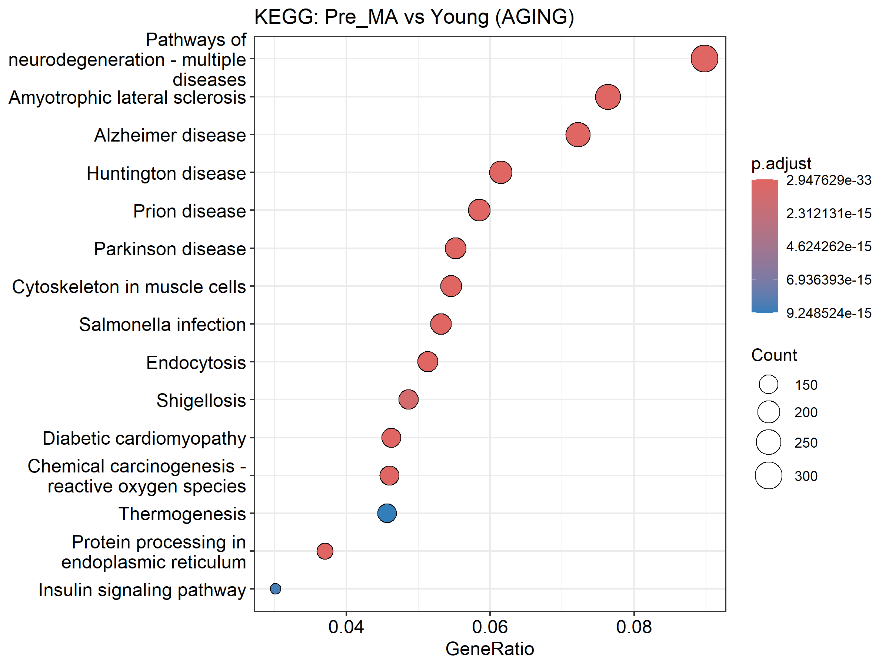

``` r
# Plot Reactome enrichment results
print(
  dotplot(
    reactome_Pre_vs_Young,
    showCategory = 15
  ) +
  ggtitle("Reactome: Pre_MA vs Young (AGING)")
)
```

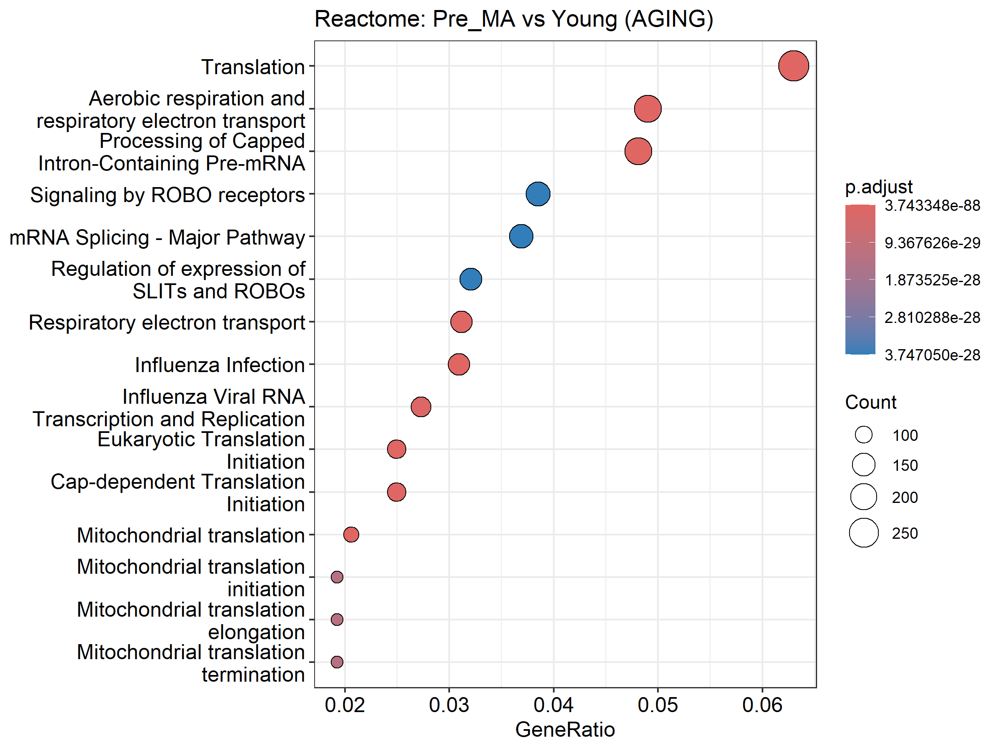

``` r
# Plot GO Biological Process enrichment results
print(
  dotplot(
    go_Pre_vs_Young,
    showCategory = 15
  ) +
  ggtitle("GO: Pre_MA vs Young (AGING)")
)
```

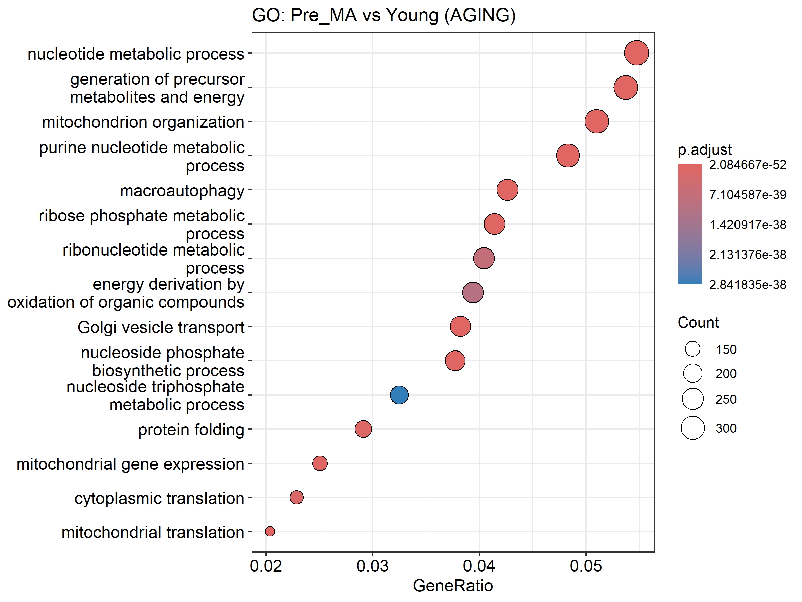

*Step-by-Step Breakdown*

`dotplot(kegg_Pre_vs_Young, showCategory = 15)`

Uses enrichplot’s `dotplot()` to create a bubble/dot plot for the KEGG enrichment object, displaying the top 15 enriched pathways by default sorted by gene ratio or p-value.

`+ ggtitle("KEGG: Pre_MA vs Young (AGING)")`

Adds a title to the ggplot object via ggplot2’s `ggtitle()`, clarifying the comparison and context.

3. `print(...)`

Ensures the plot is rendered in non-interactive R sessions or scripts; explicitly prints the combined plot object to the current graphics device.

4. Repeat for `reactome_Pre_vs_Young` and `go_Pre_vs_Young`

Generates analogous plots for Reactome and GO Biological Process results, each showing the top 15 terms and bearing its own title.

*Key Packages*

enrichplot: Provides the `dotplot()` function tailored for enrichment result objects from clusterProfiler and ReactomePA.

ggplot2: Underpins the plotting system, used here for adding titles (`ggtitle()`) and handling plot objects.

grid (implicitly via base R): Manages the display of multiple plots when using `print()`.

---

## SECTION 10: Facetted “Zoom-In” Pathway Plots (p ≤ 0.10 only)

*Purpose*

- Define concise sets of biologically relevant pathways for KEGG, Reactome, and GO so that subsequent plots can focus (“zoom in”) on these specific targets, filtered by p ≤ 0.10.


``` r
# ---- 10. Facetted “Zoom-In” Pathway Plots (p ≤ 0.10 only) ----

# Define pathway targets for aging and training
kegg_targets <- c(
  Glutathione   = "Glutathione metabolism",
  Proteasome    = "Proteasome",
  ER_Processing = "Protein processing in endoplasmic reticulum",
  Ubiquitin     = "Ubiquitin mediated proteolysis"
)

reactome_targets <- c(
  DetoxROS       = "Detoxification of Reactive Oxygen Species",
  ERAD           = "ER-Associated Degradation (ERAD)",
  Folding        = "Protein folding",
  Macroautophagy = "Macroautophagy"
)

go_targets <- c(
  OxidativeStress = "response to oxidative stress",
  ProteinFolding  = "protein folding",
  Proteolysis     = "proteasome-mediated ubiquitin-dependent protein catabolic process",
  UPR             = "endoplasmic reticulum unfolded protein response"
)
```

*Step-by-Step Breakdown*

1. `kegg_targets <- c(...)`

- Constructs a named character vector where each name (e.g., "Glutathione") is a short label used for faceting or annotation, and each value is the exact KEGG pathway string to match in your enrichment results.

2. `reactome_targets <- c(...)`

- Similarly creates a named vector of key Reactome pathways of interest, mapping concise labels ("DetoxROS", "ERAD", etc.) to full pathway names for subsetting.

3. `go_targets <- c(...)`

- Defines a named vector of GO Biological Process terms, pairing simple labels with their corresponding GO descriptions for focused plotting.

*Key Packages*

Vectors will be used downstream with packages like dplyr and ggplot2 to filter enrichment result objects and generate facetted visualizations.

---

## SECTION 11: Function to Create Individual Zoom-In Plots with Expanded Thresholds

*Purpose*

- Define function to extract genes from a specific enriched pathway, filter them by an adjusted-p threshold, assign significance stars, and generate a horizontal bar plot of their log2 fold-changes with clear annotations.


``` r
# ---- 11. Function to create individual zoom-in plots with expanded thresholds ----
create_zoom_in_plot <- function(enrichment, pathway_name, target_description, contrast, db_name, max_genes = 10) {
  # 1. Locate the exact pathway description; fall back to grep if needed
  idx <- which(enrichment$Description == target_description)
  if (length(idx) == 0) idx <- grep(target_description, enrichment$Description, ignore.case = TRUE)
  if (length(idx) == 0) return(NULL)  # No matching pathway
  
  # 2. Split the geneID field (Entrez IDs separated by "/") into a vector
  genes   <- str_split(enrichment$geneID[idx[1]], "/")[[1]]
  # 3. Map Entrez IDs back to gene symbols via the entrez_map lookup
  symbols <- entrez_map$SYMBOL[match(genes, entrez_map$ENTREZID)]
  
  # 4. Build a data frame of gene stats, filtering by adjusted p ≤ 0.20
  plot_data <- gene_stats %>%
    filter(
      Gene_Symbol %in% symbols,
      .data[[paste0("adj_", contrast)]] <= 0.20
    ) %>%
    transmute(
      Gene_Symbol,  # Keep the gene symbol
      value       = .data[[paste0("log2FC_", contrast)]],  # Corresponding log2FC
      star        = case_when(  # Significance stars
        .data[[paste0("adj_", contrast)]] < 0.001 ~ "***",
        .data[[paste0("adj_", contrast)]] < 0.01  ~ "**",
        .data[[paste0("adj_", contrast)]] < 0.05  ~ "*",
        .data[[paste0("adj_", contrast)]] < 0.10  ~ ".",
        TRUE                                      ~ ""
      ),
      significance = case_when(  # Categorical significance labels
        .data[[paste0("adj_", contrast)]] < 0.05  ~ "Significant",
        .data[[paste0("adj_", contrast)]] < 0.10  ~ "Near Significant",
        .data[[paste0("adj_", contrast)]] < 0.20  ~ "Trending",
        TRUE                                      ~ "Not Significant"
      )
    ) %>%
    arrange(desc(value)) %>%  # Sort by descending log2FC
    head(max_genes)           # Keep only top N genes
  
  if (nrow(plot_data) == 0) return(NULL)  # Nothing to plot
  
  # 5. Generate and print the ggplot
  print(
    ggplot(plot_data, aes(x = reorder(Gene_Symbol, value), y = value, fill = significance)) +
      geom_col(show.legend = TRUE) +  # Bar plot of log2FC
      geom_text(
        aes(label = star),
        hjust = -0.3, size = 5, fontface = "bold"
      ) +  # Add stars just outside the bars
      coord_flip() +  # Horizontal bars
      scale_fill_manual(values = c(  # Custom fill colors
        "Significant"         = "#D55E00",
        "Near Significant"    = "#F0E442",
        "Trending" = "#009E73",
        "Not Significant"     = "#C0C0C0"
      )) +
      labs(
        title    = paste(db_name, "Pathway:", pathway_name, "(", contrast, ")"),
        subtitle = paste(
          "Pathway:", target_description,
          "\nSignificance: *** p<0.001, ** p<0.01, * p<0.05, . p<0.10, marginal p<0.20"
        ),
        x        = "Gene Symbol",
        y        = paste0("log₂ Fold Change (", contrast, ")"),
        caption  = "Bars = log2FC; color = adjusted-p significance."
      ) +
      theme_minimal(base_size = 14) +  # Clean theme
      theme(
        plot.title    = element_text(face = "bold", size = 16),
        plot.subtitle = element_text(size = 14, margin = margin(b = 10)),
        axis.text.y   = element_text(size = 12),
        axis.text.x   = element_text(size = 12),
        axis.title    = element_text(size = 14, face = "bold"),
        plot.caption  = element_text(size = 10, face = "italic"),
        legend.title  = element_text(size = 12),
        legend.text   = element_text(size = 12)
      )
  )
}
```

*Step-by-Step Breakdown*

1. Locate pathway index

- Uses `which()` for exact match on Description; if none found, falls back to `grep()` ignoring case; returns `NULL`` if still not found.

2. Extract gene list

- Splits the /-separated geneID string into individual Entrez IDs using stringr’s `str_split()`, then maps them back to `Gene_Symbol` via the `entrez_map` lookup table.

3. Filter and annotate

  - Filters `gene_stats` to genes in the pathway whose adjusted p-value for the given contrast is ≤ 0.20.

  - Uses `transmute()` to:

  - Pull out `Gene_Symbol` and the appropriate `log2FC_*` value.

  - Create `star`, a string of significance asterisks based on adjusted-p thresholds.

  - Create `significance`, a categorical label (“Significant,” “Near Significant,” etc.).

4. Sort and limit

Orders by descending value (`log2FC`) and retains only the top `max_genes`.

5. Plotting

  - Constructs a horizontal bar plot `(geom_col() + coord_flip())`.

  - Overlays significance stars with `geom_text()`, just outside each bar.

  - Applies `scale_fill_manual()` to assign distinct colors to each `significance` category.

  - Adds descriptive titles, subtitles, axis labels, and a caption via `labs()`.

  - Applies a minimalist theme and customizes text sizes and styles with `theme()`.

*Key Packages*

dplyr: Data manipulation (`filter()`, `transmute()`, `arrange()`, `head()`), piping, and use of the `.data` pronoun.

stringr: String splitting (`str_split()`) for processing the geneID field.

ggplot2: Plot construction and customization (`ggplot()`, `geom_col()`, `geom_text()`, `coord_flip()`, `scale_fill_manual()`, `labs()`, `theme_minimal()`, `theme()`).

rlang: Enables the use of `.data[[...]]` for programmatic column access within dplyr pipelines.

---

## SECTION 12: 

*Purpose*

- Loop over defined contrasts (aging) and key pathway sets (KEGG, Reactome, GO), retrieve the corresponding enrichment results, and invokes the `create_zoom_in_plot()` function to produce focused bar plots for each pathway.


``` r
# ---- 12. Generate plots for each database and contrast ----

# Define the contrasts to iterate over: aging (Pre_vs_Young), *could use and alter for other comparisons, but keeping it simple for now*
contrasts <- c("Pre_vs_Young")

# KEGG pathways: for each contrast and each target pathway, generate a zoom-in plot
for (contrast in contrasts) {
  for (pathway_name in names(kegg_targets)) {
    # Retrieve the KEGG enrichment result object for this contrast
    enrichment <- enrichment_results[[paste0("KEGG_", contrast)]]
    # Produce the bar plot for this pathway
    create_zoom_in_plot(
      enrichment,
      pathway_name,
      kegg_targets[[pathway_name]],
      contrast,
      db_name   = "KEGG",
      max_genes = 20
    )
  }
}
```

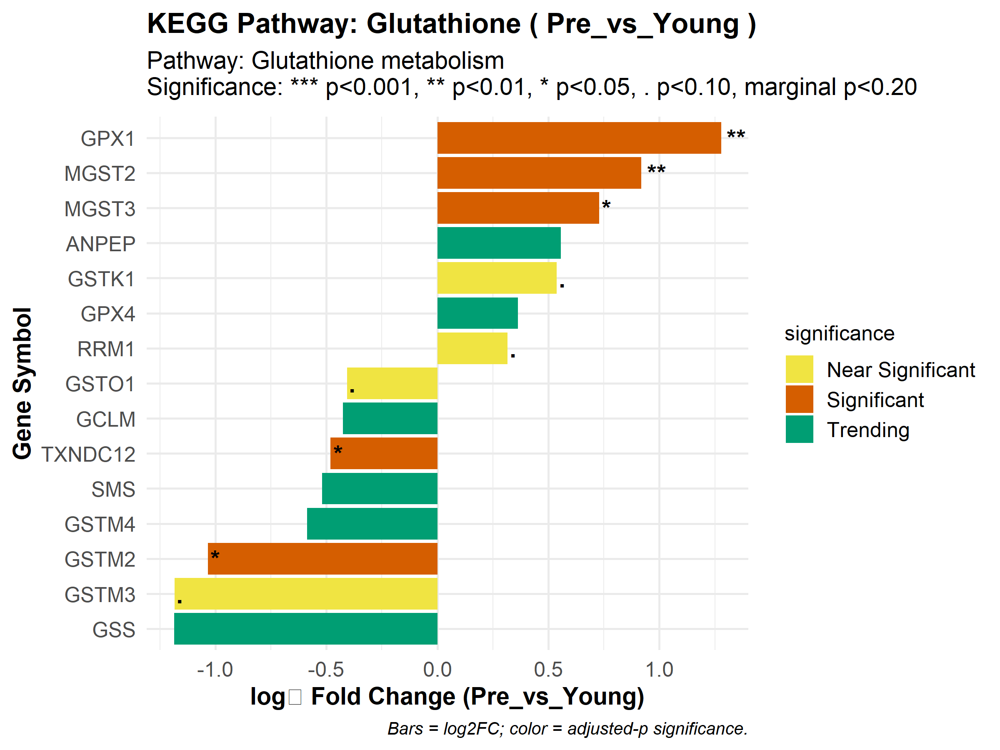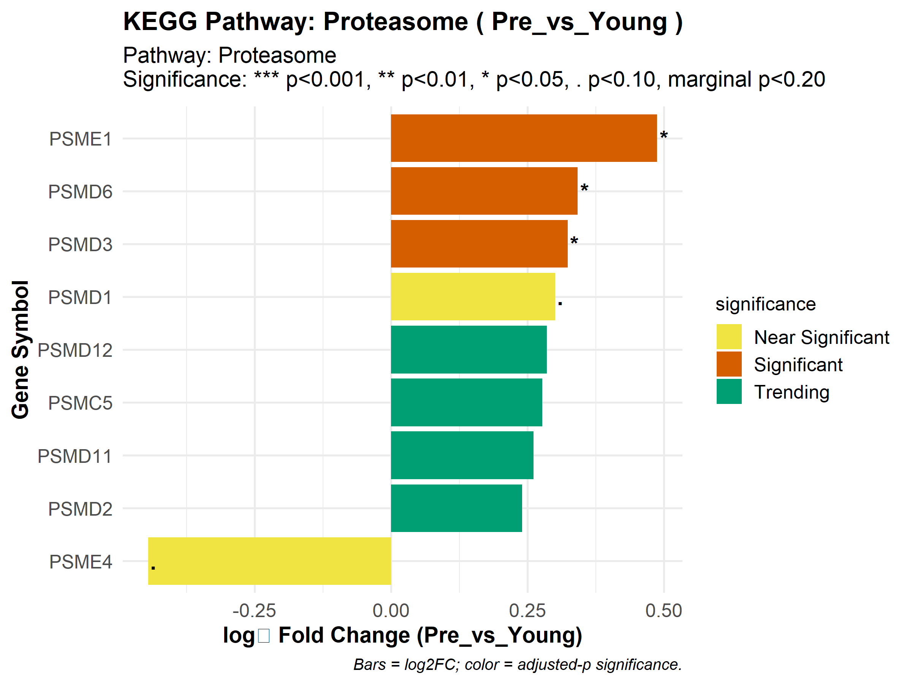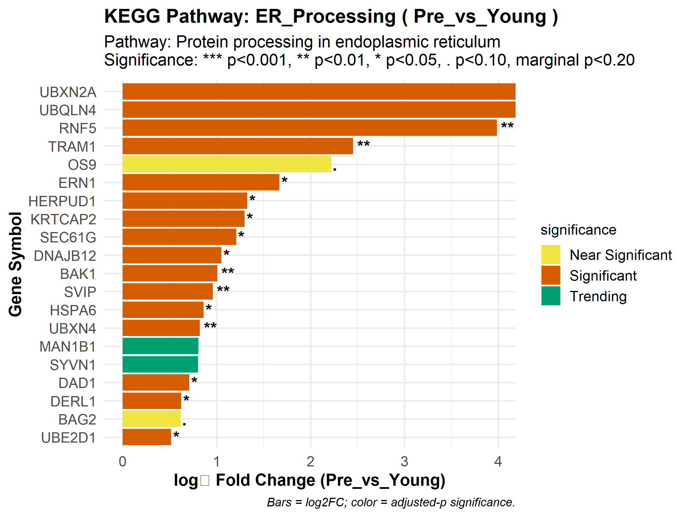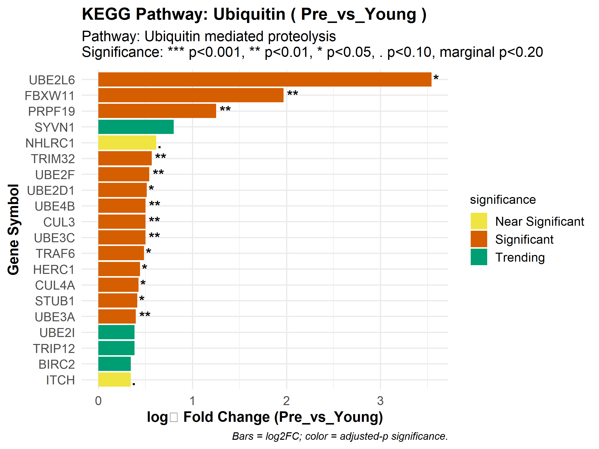

``` r
# Reactome pathways: same logic as KEGG but using Reactome target list
for (contrast in contrasts) {
  for (pathway_name in names(reactome_targets)) {
    enrichment <- enrichment_results[[paste0("Reactome_", contrast)]]
    create_zoom_in_plot(
      enrichment,
      pathway_name,
      reactome_targets[[pathway_name]],
      contrast,
      db_name   = "Reactome",
      max_genes = 20
    )
  }
}
```

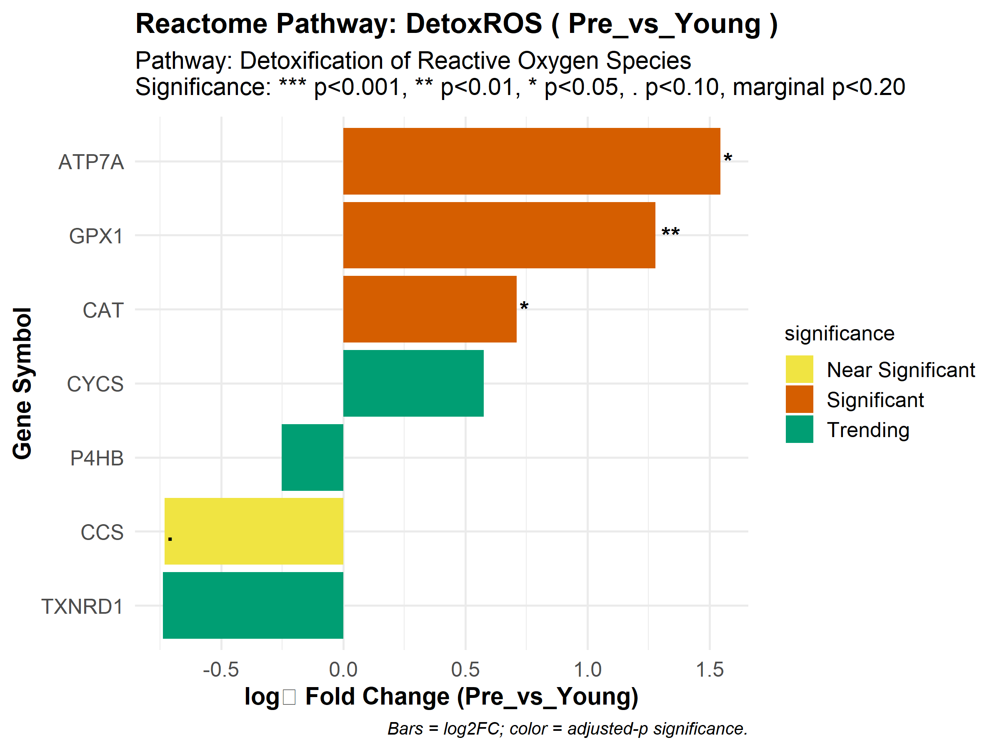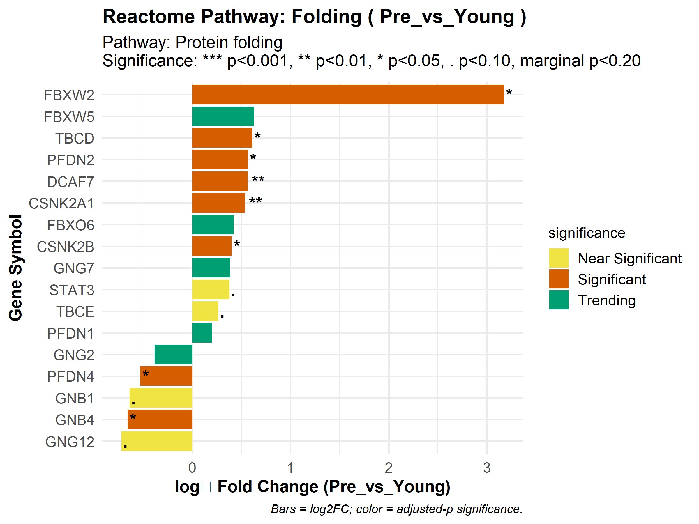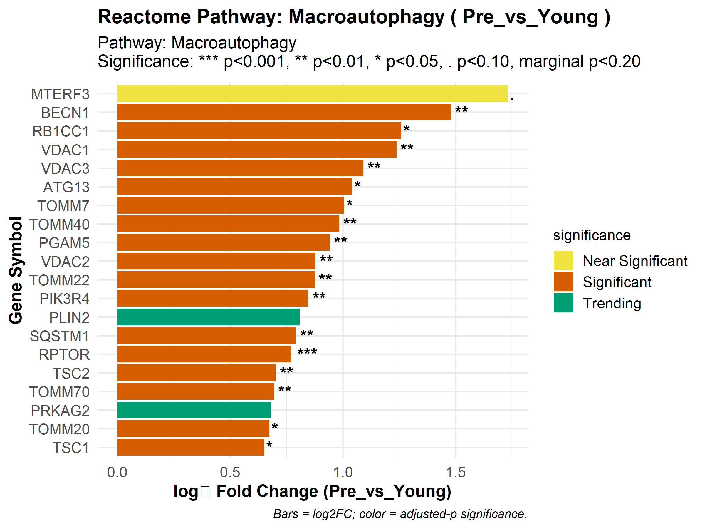

``` r
# GO Biological Process pathways: loop over GO targets
for (contrast in contrasts) {
  for (pathway_name in names(go_targets)) {
    enrichment <- enrichment_results[[paste0("GO_", contrast)]]
    create_zoom_in_plot(
      enrichment,
      pathway_name,
      go_targets[[pathway_name]],
      contrast,
      db_name   = "GO",
      max_genes = 20
    )
  }
}
```

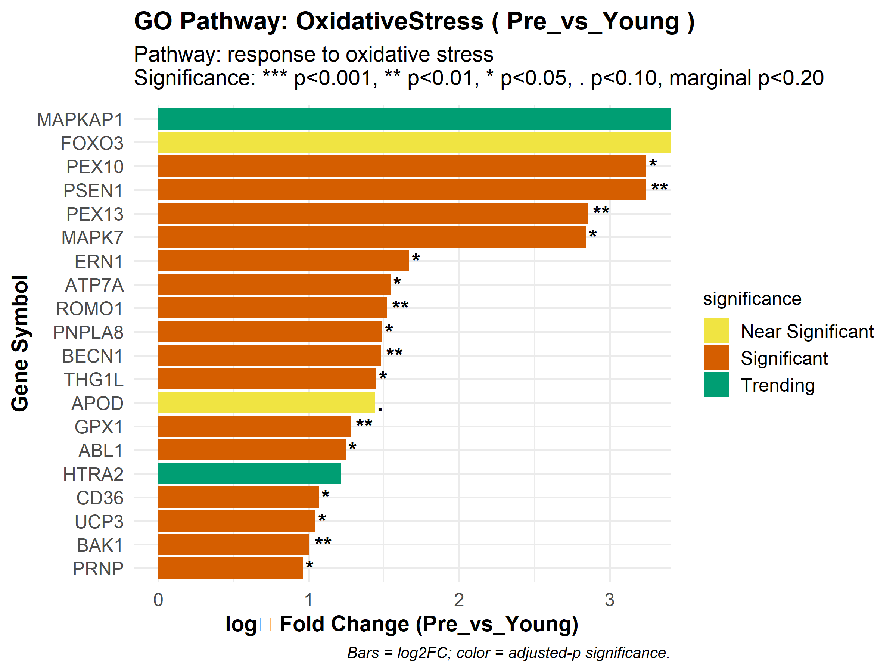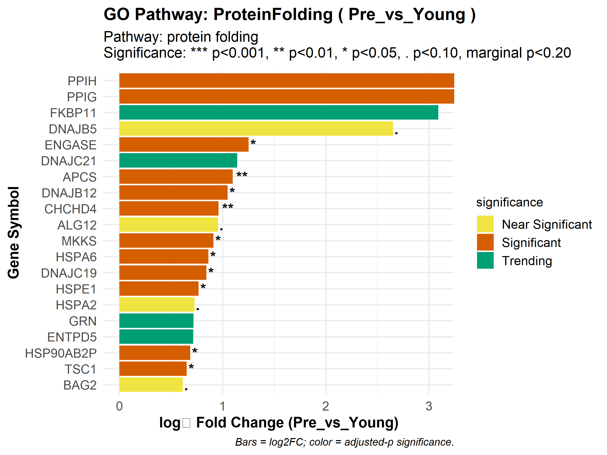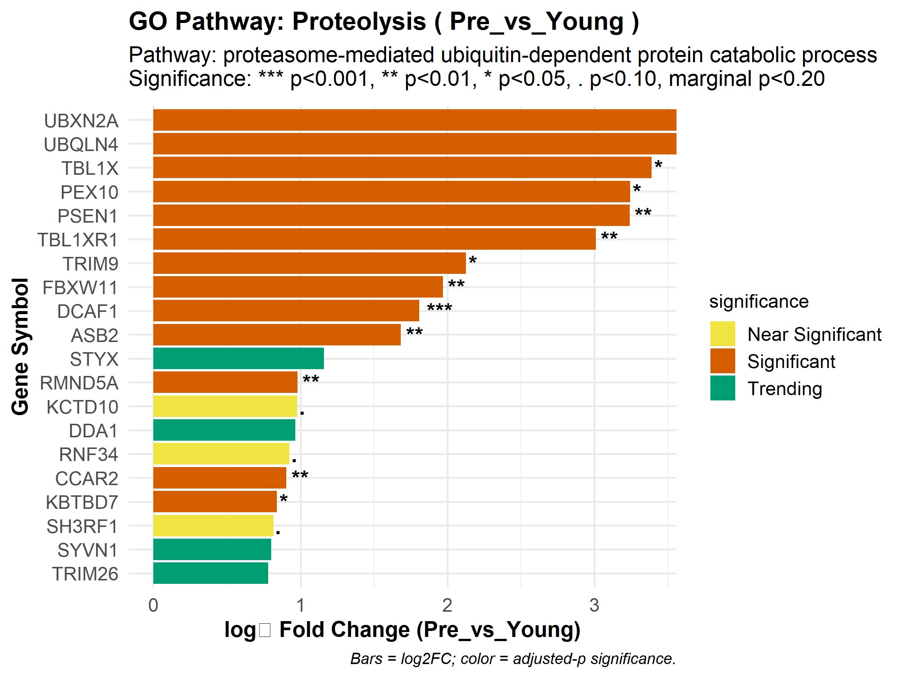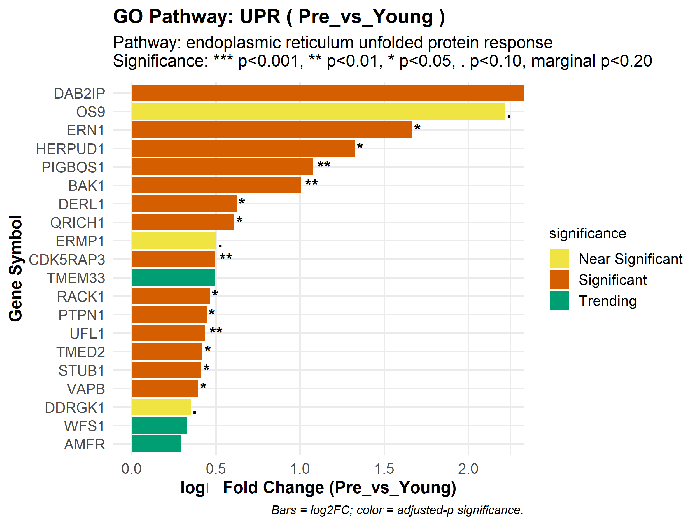

*Step-by-Step Breakdown*

1. `contrasts <- c("Pre_vs_Young", ...)`

- Defines a character vector of the comparisons to analyze: aging (“Pre_vs_Young”) or possibly training response (“Post_vs_Pre_MA”) in the future.

2. `for (contrast in contrasts) { … }`

- Outer loop: iterates over each contrast string.

3. `for (pathway_name in names(kegg_targets)) { … }`

- Inner loop: iterates over the named elements of the `kegg_targets` vector, so you handle each pathway label (“Glutathione”, “Proteasome”, etc.).

4. `enrichment <- enrichment_results[[paste0("KEGG_", contrast)]]`

- Dynamically constructs the list name (e.g., `“KEGG_Pre_vs_Young”`) and extracts that enrichment result object from `enrichment_results`.

5. `create_zoom_in_plot(enrichment, pathway_name, kegg_targets[[pathway_name]], contrast, "KEGG", max_genes = 20)`

- Calls the previously defined plotting function, passing:

  - `enrichment`: the enrichment object,

  - `pathway_name`: the short label,

  - `kegg_targets[[pathway_name]]`: the full pathway description,

  - `contrast`: which log₂FC column and p-values to use,

  - `"KEGG"`: the database name for titles,

  - `max_genes = 20`: cap at 20 genes per plot.

6. Repeat for Reactome and GO

Uses the same looping structure and function call, simply swapping in `reactome_targets`/`GO_targets` and the appropriate prefix in `enrichment_results` (e.g., “Reactome_Post_vs_Pre_MA”).

*Key Packages*

ggplot2, dplyr, stringr, rlang: Employed indirectly by `create_zoom_in_plot()` for data manipulation, filtering, and plotting, enabling the generation of the annotated bar charts.
